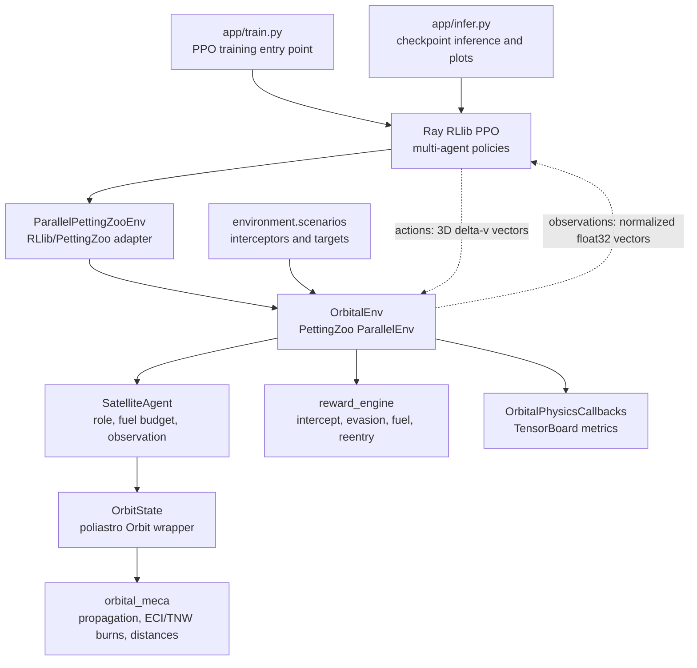
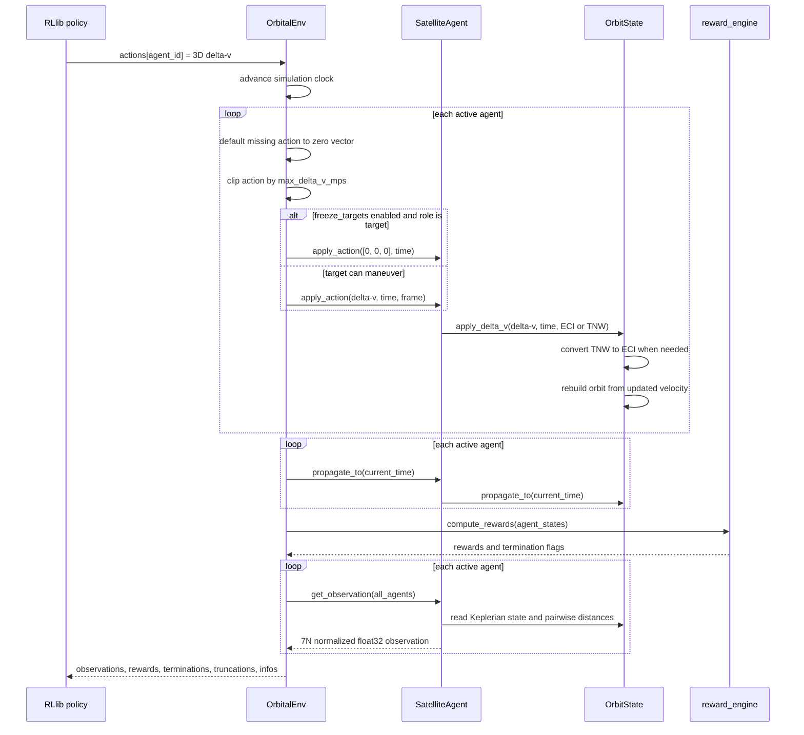

# Architecture

This document summarizes the runtime shape of the project. The important boundary is
between the reinforcement-learning interface, which exchanges plain NumPy arrays, and
the orbital mechanics core, which keeps physical quantities unit-aware with Astropy.

## Runtime Architecture

## Environment Step Lifecycle

## Main Code Paths

- `app/train.py` is the standard PPO entry point; shared PPO/Tune setup lives in
  `src/main/python/experiment/train.py`.
- `app/curriculum_train.py` is the callback-based curriculum entry point. It
  loads the ordered curriculum config, uses one continuous RLlib/Tune run, and
  delegates stage transitions to `CurriculumCallbacks.on_train_result()`.
- `app/infer.py` loads a checkpoint, computes deterministic actions, steps the
  same environment, and produces trajectory/metric plots.
- `src/main/python/utils/rllib_setup.py` centralizes run configuration, fixed
  multi-agent policy setup, environment creation, curriculum batch trainability,
  and inference action helpers.
- `src/main/python/environment/orbital_env.py` owns the multi-agent simulation
  loop and the RL-facing spaces.
- `src/main/python/agents/satellite_agent.py` owns per-agent state, fuel usage,
  and observation construction.
- `src/main/python/agents/orbit_state.py` wraps Poliastro and keeps maneuver,
  propagation, and Keplerian conversion behavior isolated.
- `src/main/python/environment/reward_engine.py` computes cooperative-competitive
  rewards and terminal condition flags from the current constellation state.
